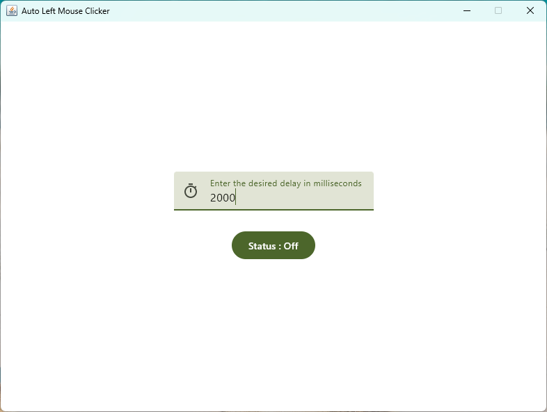

## Left Mouse Clicker

Multi platform mouse clicker application with kotlin compose

## Installation

1. Run this command in IntelliJ IDEA terminal

```bash
./gradlew packageDistributionForCurrentOS
```

2. Wait until it's finished, then run the executable file based on the OS in the folder: pathToProject\build\compose\binaries\main\exe or dmg or deb\AutoClick-version.systemExecutable file

## App ScreenShoot
[](metadata/videos/simple_app_usage.mp4)
